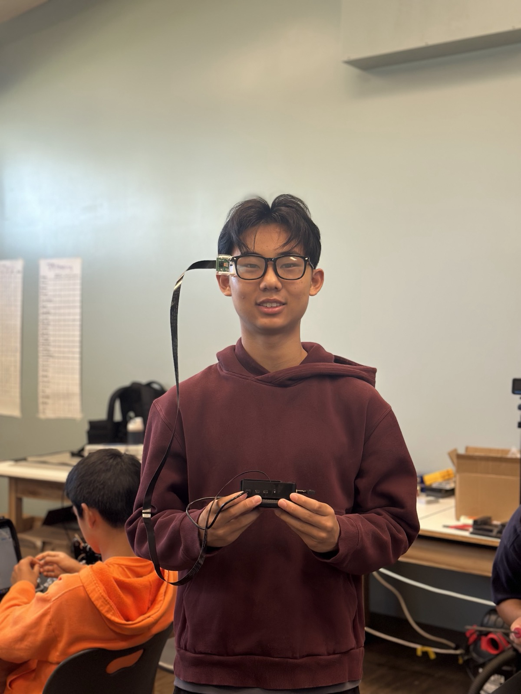
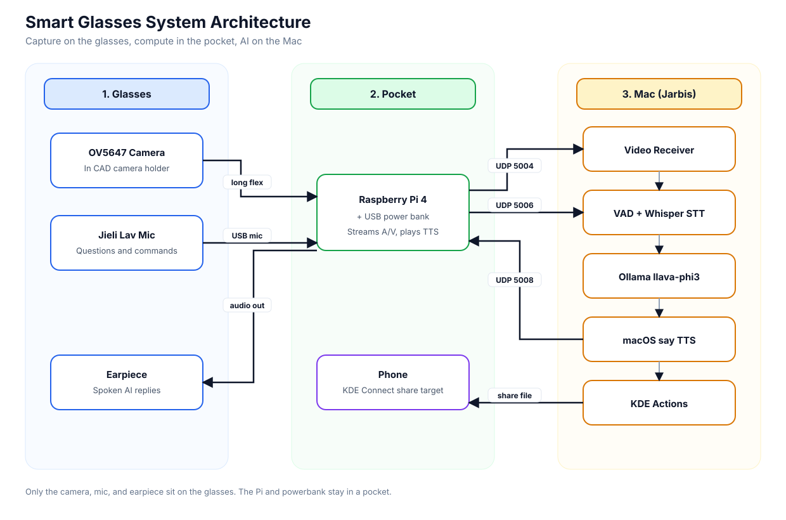
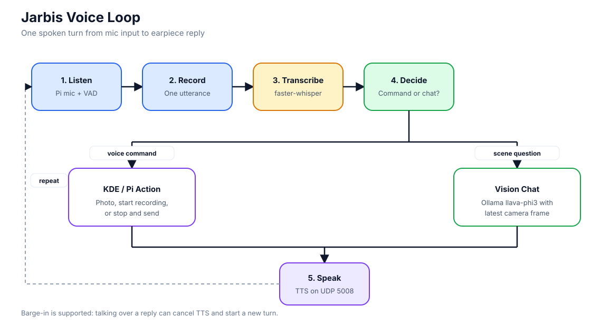

# Smart Glasses

My Smart Glasses project is an AI-powered wearable assistant that lets me ask about what I'm looking at and hear spoken answers in real time. A camera and mic on the glasses stream video and voice over Wi-Fi to a Mac running Ollama (`llava-phi3`) and faster-whisper; the Mac reasons about the scene and streams text-to-speech back to an earpiece. The Raspberry Pi and powerbank stay in my pocket on a long flex cable so the glasses stay light. This project challenged me to integrate hardware, networking, speech, and local vision AI into one working loop.

| **Engineer** | **School** | **Area of Interest** | **Grade** |
|:--:|:--:|:--:|:--:|
| Lewis H | Los Altos High School | Artificial Intelligence | Incoming Junior

**Image of me with my completed Smart Glasses project**


  
# Final Milestone

<iframe width="560" height="315" src="https://www.youtube.com/embed/8Ru6fObYa5k" title="YouTube video player" frameborder="0" allow="accelerometer; autoplay; clipboard-write; encrypted-media; gyroscope; picture-in-picture; web-share" allowfullscreen></iframe>

For my final milestone, I finished the full AI voice assistant loop (Jarbis) and my main modification: a custom CAD camera holder that mounts the OV5647 to the glasses. The Pi and powerbank ride in my pocket and connect to the glasses with a long flex cable. Live video (UDP 5004) and mic audio (UDP 5006) stream to a Mac; the Mac runs VAD, faster-whisper STT, Ollama `llava-phi3` vision chat, and macOS `say` TTS, then sends audio back to the Pi on UDP 5008. I can ask what the camera sees, interrupt replies (barge-in), and use voice commands to take a photo or record video and send it to my phone with KDE Connect.

**Technical Progress Made:**
- Built the end-to-end Jarbis coordinator (`receiver.py`): listen, record utterance, STT, AI, speak
- Streamed Pi camera video and wireless lav mic audio to the Mac; returned higher-quality TTS to the earpiece
- Ran local AI with Ollama (`llava-phi3`), short system prompts, and auto vision only when I ask about the scene
- Added working mic input with energy VAD, faster-whisper (`small.en`), and echo/barge-in handling
- Wired voice commands for take photo / start recording / stop and send via KDE Connect
- Designed, iterated, 3D printed, and glued a CAD camera holder onto the glasses (modification)

**Challenges Faced:**
The hardest part was making the full loop reliable. Early Bluetooth phone links were unstable, so I moved image/control traffic to KDE Connect and AI traffic to Wi-Fi UDP streams. The mic path needed real debugging too (48 kHz capture downsampled to 16 kHz, USB resets, VAD thresholds) before speech was clean enough for STT. On the AI side, short prompts, history limits, and vision-only-when-asked were needed so `llava-phi3` stayed snappy and didn't ramble. The CAD holder also took multiple Onshape revisions after early prints came out too thick or didn't sit right on the frame.

**What I Learned & Future Goals:**
At BSE I learned Raspberry Pi setup, networking/streaming, CAD in Onshape, speech pipelines (VAD/STT/TTS), and how much prompting and system design matter for local vision models. My biggest triumph was turning separate pieces (pocket Pi, glasses camera/mic, phone sharing, and Mac AI) into one wearable assistant I can actually talk to. Next I want a more stable always-on mic link, a sleeker mechanical design, lower latency, and maybe phone notifications or a small display.

# Second Milestone

<iframe width="560" height="315" src="https://www.youtube.com/embed/FjdVhPEqN3U" title="YouTube video player" frameborder="0" allow="accelerometer; autoplay; clipboard-write; encrypted-media; gyroscope; picture-in-picture; web-share" allowfullscreen></iframe>

Since my first milestone, I focused on turning the working Raspberry Pi system into a real wearable and connecting it to my phone and computer. I kept the Pi and powerbank off the frame (pocket carry) and used a longer flex cable so only the camera and audio gear sit on the glasses. I also started the mechanical mount work and the first streaming/connectivity layer that the final AI loop depends on.

**Technical Progress Made:**
- Mounted the camera path on the glasses with a longer flex cable and pocket-carried Pi + powerbank
- Assembled and tested an early camera holder design on the frames
- Set up phone-to-glasses communication so I could trigger a photo and send the image back
- Switched from unstable Bluetooth to KDE Connect for reliable command + file sharing
- Implemented live video streaming from the Raspberry Pi for remote viewing and testing
- Designed an initial CAD camera holder in Onshape and sent it to be 3D printed

**Challenges Faced:**
The main challenge was wireless communication. I originally planned on Bluetooth for phone control and image transfer, but it was unstable for what I needed. After researching options like PyBluez and testing different approaches, I switched to KDE Connect, which let my phone send a command to the glasses and receive the picture more reliably. I also learned that my first CAD holder was too thick and needed redesign before it would sit well on the glasses.

**Plan to Complete:**
For my final milestone, I need to finish a refined CAD camera holder, complete the Mac-side AI pipeline (vision model + speech), add working mic input, improve TTS quality back to the Pi, and fully integrate the streams so I can talk to the glasses and get spoken answers about what the camera sees.

# First Milestone

<iframe width="560" height="315" src="https://www.youtube.com/embed/kVgBthoMpxw" title="YouTube video player" frameborder="0" allow="accelerometer; autoplay; clipboard-write; encrypted-media; gyroscope; picture-in-picture; web-share" allowfullscreen></iframe>

My Smart Glasses project is an AI-powered wearable device that provides real-time object identification and audio feedback. The system consists of a Raspberry Pi connected to a camera module and an earpiece, running TensorFlow-based object detection with text-to-speech output.

**Technical Progress Made:**
- Set up and configured Raspberry Pi with SSH/VNC remote access
- Integrated camera module with the Raspberry Pi after troubleshooting connection issues
- Implemented TensorFlow object detection code that identifies objects and announces them via TTS
- Connected powerbank for portable power and configured code to run on boot
- Optimized detection confidence values for improved accuracy and speed

**Challenges Faced:**
The main challenge was getting the camera to work with the Raspberry Pi. Initially, the camera wouldn't connect properly, which required troubleshooting dependency issues and ultimately flashing a new SD card with an updated OS to resolve compatibility problems.

**Plan to Complete:**
For my next milestone, I need to assemble all components onto the glasses frame with proper wire management, mount the Raspberry Pi securely, and test the system in real-world scenarios. Future enhancements may include 3D-printed enclosures, Bluetooth connectivity to a phone, and a transparent OLED display for visual information.

# Schematics

The system is split into three places: capture gear on the glasses, the Raspberry Pi and powerbank in my pocket, and the Jarbis AI stack on my Mac.



**How the pieces connect**
- Camera video goes from the glasses to the Pi over a long flex cable, then to the Mac on UDP 5004
- Mic audio goes from the wireless lav to the Pi, then to the Mac on UDP 5006
- Spoken replies go from the Mac back to the Pi on UDP 5008, then out the earpiece
- Photo and video share commands go through KDE Connect to my phone

**Hardware notes**
- The camera sits sideways in the CAD holder, so software rotates the image 90 degrees
- The Pi stays pocketed so the glasses only carry the light camera, mic, and audio path

# Code

Most of the final project code is a Mac-side coordinator in `pi-receiver` plus Pi stream scripts in `pi-stream`.



**What each major file does**
- `stream.sh` on the Pi starts the camera and mic streams and keeps the TTS audio sink running
- `receiver.py` on the Mac is the main loop: listen, record, transcribe, decide, speak
- `vad.py` and `stt_handler.py` turn mic audio into text with energy VAD and faster-whisper
- `ai_processor.py` talks to Ollama (`llava-phi3`) and only attaches a camera frame when the question is about the scene
- `tts_handler.py` uses macOS `say` and streams the reply audio back to the Pi
- `kde_actions.py` plus Pi scripts handle voice commands for take photo, start recording, and stop/send

**Main loop behavior**
1. Wait for speech on the Pi mic
2. Transcribe with faster-whisper
3. If it is a camera command, run the KDE/Pi action and confirm by voice
4. Otherwise ask Ollama, optionally with the latest camera frame
5. Speak the reply back through the earpiece, with barge-in if I talk over it

Not every file is pasted below, but these samples cover the main Pi and Mac paths used in the final build.

### Pi sample 1: live camera + mic stream (`stream.sh`)

This runs on the Raspberry Pi. The camera is mounted sideways, so the video is rotated before it is sent. The lav mic is captured at 48 kHz and downsampled to 16 kHz for speech recognition on the Mac.

```bash
# Video: sideways cam -> rotate -> UDP to Mac
rpicam-vid --inline --width 480 --height 640 --framerate 8 \
    --codec mjpeg --quality 88 --timeout 0 -o - | \
ffmpeg -fflags nobuffer -flags low_delay -f mjpeg -i - \
    -vf transpose=2 -q:v 5 -f mjpeg \
    "udp://${MAC_IP}:${VIDEO_PORT}?pkt_size=1316" &

# Mic: native 48 kHz -> 16 kHz mono PCM over UDP
arecord -f S16_LE -r 48000 -c 1 -D hw:3,0 -q - | \
ffmpeg -f s16le -ar 48000 -ac 1 -i - \
    -af "highpass=f=80,lowpass=f=6000,volume=12dB" \
    -f s16le -ar 16000 -ac 1 \
    "udp://${MAC_IP}:${AUDIO_PORT}?pkt_size=1316" &
```

### Pi sample 2: take photo and send to phone (`voice_cmds.sh`)

When I say "take a photo," the Mac tells the Pi to pause the live stream, capture a still, rotate it, and share it to my phone with KDE Connect.

```bash
cmd_take_photo() {
  pause_stream >/dev/null
  raw="/tmp/pic_raw_$(date +%Y%m%d_%H%M%S).jpg"
  file="/tmp/pic_$(date +%Y%m%d_%H%M%S).jpg"

  # Camera is sideways, so capture tall then rotate to landscape
  rpicam-still -n -o "$raw" --timeout 800 --width 1080 --height 1920 --quality 95
  ffmpeg -y -loglevel error -i "$raw" -vf "transpose=2" -q:v 2 "$file"
  kdeconnect-cli -d "$DEVICE_ID" --share "$file"

  # Resume live stream unless a video recording is active
  if [ ! -f /tmp/kde_video_rec.pid ]; then
    resume_stream
  fi
  echo "OK photo sent to phone: $(basename "$file")"
}
```

### Pi sample 3: record video, rotate, and share (`kde_video_rec.sh`)

```bash
if [ "$1" = "start" ]; then
  VID_FILE="$VID_DIR/video_$(date +%Y%m%d_%H%M%S).h264"
  nohup rpicam-vid -o "$VID_FILE" --timeout 0 --inline \
      --width 720 --height 1280 --framerate 30 > "$LOG_FILE" 2>&1 &
  echo "$!|$VID_FILE" > "$PID_FILE"
  echo "Recording started"

elif [ "$1" = "stop" ]; then
  LINE=$(cat "$PID_FILE")
  VID_PID=$(echo "$LINE" | cut -d'|' -f1)
  VID_FILE=$(echo "$LINE" | cut -d'|' -f2)
  kill "$VID_PID" 2>/dev/null
  rm -f "$PID_FILE"

  MP4_FILE="${VID_FILE%.h264}.mp4"
  ffmpeg -y -i "$VID_FILE" -vf "transpose=2" \
      -c:v libx264 -preset veryfast -crf 23 -an "$MP4_FILE"
  kdeconnect-cli -d "$DEVICE_ID" --share "$MP4_FILE"
  echo "Sent to phone"
fi
```

### Mac sample 1: one Jarbis turn (`receiver.py`)

This is the core Mac loop. It takes one spoken utterance, checks for photo/record commands, optionally attaches a fresh camera frame, asks the local vision model, and speaks the reply back to the Pi.

```python
utt = self.collector.collect()  # VAD-gated utterance from Pi mic
text, stt_meta = self.stt.transcribe_ex(utt)  # faster-whisper
if not text:
    return

# Photo / record commands go to the Pi + phone via KDE Connect
cmd = handle_voice_command(text, config=self.cfg)
if cmd and cmd.handled:
    self.tts.speak(cmd.message, stream_to_pi=True, cancel_check=self._barge_check)
    return

# Only attach vision when the user asks about the scene
frame = None
if self.vision_on and self._wants_vision(text):
    frame, status = self.video.wait_for_frame(timeout_s=4.0, max_age_s=2.5)

reply = self.ai.process_text(
    text,
    image=frame,
    system_prompt=self.system_prompt,  # Ollama llava-phi3
)
self.tts.speak(reply, stream_to_pi=True, cancel_check=self._barge_check)
```

### Mac sample 2: energy VAD (`vad.py`)

This turns the continuous mic stream into one utterance by watching loudness over time.

```python
def feed(self, rms: float, now: float):
    """Return 'speech_start', 'speech_end', or None."""
    above = rms >= self.threshold

    if self.state == self.SILENCE:
        if above:
            if self._above_since is None:
                self._above_since = now
            if (now - self._above_since) * 1000 >= self.speech_start_ms:
                self.state = self.SPEAKING
                return "speech_start"
        else:
            self._above_since = None
    else:  # currently speaking
        if not above:
            if self._below_since is None:
                self._below_since = now
            if (now - self._below_since) * 1000 >= self.silence_ms:
                self.state = self.SILENCE
                return "speech_end"
        else:
            self._below_since = None
    return None
```

### Mac sample 3: local vision chat (`ai_processor.py`)

```python
def process_text(self, prompt, image=None, system_prompt=None):
    img_b64 = self._encode_image_b64(image) if image is not None else ""

    messages = [{"role": "system", "content": system_prompt or (
        "You are a snappy voice assistant named Jarbis."
    )}]
    messages.extend(self._clean_history(for_vision=bool(img_b64)))

    user_msg = {"role": "user", "content": prompt.strip()}
    if img_b64:
        # Attach the current Pi camera frame for this turn only
        user_msg["images"] = [img_b64]
    messages.append(user_msg)

    response = self.client.chat(
        model=self.model,  # llava-phi3
        messages=messages,
        options={"num_predict": 100, "temperature": 0.3, "top_p": 0.9},
    )
    return response["message"]["content"].strip()
```

### Mac sample 4: speak reply back to the Pi (`tts_handler.py`)

```python
def speak(self, text, stream_to_pi=True, cancel_check=None):
    output_file = Path(tempfile.gettempdir()) / "pi_response.aiff"

    # macOS TTS -> AIFF
    subprocess.run(["say", "-v", self.voice, "-o", str(output_file), text], check=True)

    # Convert to raw 16 kHz mono PCM and stream over UDP 5008
    proc = subprocess.run(
        ["ffmpeg", "-loglevel", "error", "-i", str(output_file),
         "-f", "s16le", "-ar", "16000", "-ac", "1", "-"],
        capture_output=True,
    )
    return self._stream_pcm(proc.stdout, cancel_check=cancel_check)
```

### Mac sample 5: match voice commands (`kde_actions.py`)

```python
def match_intent(text: str):
    t = (text or "").lower().strip()
    patterns = {
        "take_photo": [r"\btake (a )?photo\b", r"\btake (a )?picture\b"],
        "start_recording": [r"\bstart recording\b", r"\brecord (a )?video\b"],
        "stop_recording": [r"\bstop recording\b", r"\bsend (the )?video\b"],
    }
    for action, pats in patterns.items():
        for pat in pats:
            if re.search(pat, t):
                return action
    return None

def run_pi_action(action: str, config=None):
    host = config.get("PI_IP")
    user = config.get("PI_SSH_USER")
    remote = f"bash ~/pi-stream/voice_cmds.sh {action}"
    proc = subprocess.run(
        ["ssh", f"{user}@{host}", remote],
        capture_output=True, text=True, timeout=120,
    )
    ok = proc.returncode == 0
    return ActionResult(True, action, ok, "Done." if ok else "Something went wrong.")
```

# Bill of Materials

| **Part** | **Note** | **Price** | **Link** |
|:--:|:--:|:--:|:--:|
| Raspberry Pi 4 Model B | Pocket computer: streams camera/mic, plays TTS, runs KDE Connect actions | ~$55-75 | <a href="https://www.raspberrypi.com/products/raspberry-pi-4-model-b/"> Link </a> |
| OV5647 Raspberry Pi Camera | Glasses-mounted camera for live vision + stills/video | ~$15-25 | <a href="https://www.amazon.com/s?k=OV5647+raspberry+pi+camera"> Link </a> |
| Long flex / ribbon camera cable | Lets Pi + powerbank stay in pocket while camera stays on glasses | ~$8-12 | <a href="https://www.amazon.com/s?k=raspberry+pi+camera+long+ribbon+cable"> Link </a> |
| USB power bank | Portable power for the pocketed Pi | ~$20-30 | <a href="https://www.amazon.com/s?k=usb+power+bank"> Link </a> |
| Glasses frame | Wearable base for CAD camera holder + cable routing | varies | Local / existing frames |
| 3D-printed CAD camera holder | Custom Onshape mount that clips/glues camera to glasses (modification) | filament ~$1-3 | Printed in lab |
| Jieli USB wireless lav mic | Mic input to Pi for voice commands and questions | ~$20-40 | <a href="https://www.amazon.com/s?k=usb+wireless+lavalier+microphone"> Link </a> |
| Earpiece / headphones | Hears macOS `say` TTS streamed back from the Mac | ~$10-20 | <a href="https://www.amazon.com/s?k=wired+earpiece"> Link </a> |
| MicroSD card | Pi OS + project scripts (`pi-stream`, KDE runcommands) | ~$10-15 | <a href="https://www.amazon.com/s?k=microsd+card"> Link </a> |
| Mac (existing) | Runs Jarbis: Whisper STT, Ollama `llava-phi3`, TTS, coordination | n/a | Existing computer |

